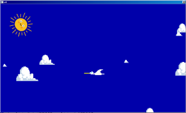

# Bitmaps

Only with the access to the framebuffer was the handling of bitmaps built, to be used as sprites or for the management of images.
In: r4 I am trying to use the memory without having to modify it, for this the bitmap is not compressed, it can be compressed in the disk but not in memory. This is why the memory for the bitmaps is uncompressed and have a minimal header, one dword!
The first 12 bits are the height of the image, the next 12 bits are the width, then there are 4 bits to different types of bitmaps, then the bit if there is a color palette or not.
Only the first 2 are full implemented (scale and rotation), The rest is partially implemented.

```
type 0: 32 bit/pixel
type 1: 32 bit/pixel with transparent channel
type 2: 16 color 565 schema
type 3: 16 bits color 4444 with alpha channel
type 4: 8 bit/pixel
type 5: 8 bit/pixel with transparent channel
type 6: 4 bit/pixel
type 7: 4 bit/pixel with transparent channel
type 8: 3 bit/pixel
type 9: 3 bit/pixel with transparent channel
type A: 2 bit/pixel
type B: 2 bit/pixel with transparent channel
type C: 1 bit/pixel
type D: 1 bit/pixel with transparent channel
types E,F: free
```

## Load Image Format

In lib/loadimg.txt we define the word for load diferent types of image file format:

```
::loadimg | filename -- img
	".jpg" =pos 1? ( drop loadjpg ; ) drop
	".png" =pos 1? ( drop loadpng ; ) drop
	".bmp" =pos 1? ( drop loadbmp ; ) drop
	".tga" =pos 1? ( drop loadtga ; )
	2drop 0 ;
```

The real code for load this file are in lib/loadbmp.txt, lib/loadpng.txt, lib/loadjpg.txt, lib/loadtga.txt. This word load in memory in the internal format of bmr files, some options of format not implemented!

## Bitmaps Sprites

The handle of bitmap images are defined in lib/bmr.txt. The main words are:

```
::bmr.draw | x y 'bmr --
::bmr.drawscale | x y 'bmr wr hr --
::bmr.drawr | x y r 'bmr --
```

Let make an example. First include gui,bmr.
part16.txt: a particle system similar to the one made in the previous chapter, with some minor diferences and some more words for map and delete particles.
anima.txt: a mini animation system, you can define a sequence of data with frame number, then every call add 1 to frame and return the correct frame, look the definition of #ave, first two 0 are space for calc, then, a draw, a time,a draw, a time and so on until the draw is 0. this draw are defined in ./draw.bmr, ave1,ave2,nube and sol are the graphics.
#nubes are the particle system.
r.1 is a random generator from -1.0 to 1.0 and r.001 is the same to -0.001 to 0.001


```
^r4/lib/gui.txt
^r4/lib/bmr.txt
^r4/lib/part16.txt
^r4/lib/anima.txt
^./draws.bmr

#ave 0 0 ave1 30 ave2 20 0

#nubes 0 0

:r.1 rand 1.0 mod ;
:r.001 rand 0.001 mod ;
```

We define the map memory for particles like:

```
vector for particle (this word), x, y ,vx, size
```

Then we need a word for exec for every particle, with the adress in mem.

`nub` take this adress and extract and modify the parameters of this,first get X,if es greater of 1.5 (ouside of screen), substract 3.0 and store and pick a random y and store too. get Y.
addvance X with x velocity and fpos convert the fixed point coordinates in real coordinates in vars `xc`,`yc`. Then fill the stack with the parameters from `bmr.drawscale`, the graphic of `'nube`, the size and the half size,width and heihgt and finally draw.
This is the draw and the behavior of nube.

`+nube` add one nube to particles system.

`ininubes` stark memory and add 20 nubes

```
:nub | adr -- 0-delete
 	>b
	b@+
	1.5 >? ( dup 3.0 - b> 4 - ! r.1 b! )
	b@+
	b@+ b> 12 - +!	| vel
	fpos
	xc yc 'nube
	b@+ dup 2/
	bmr.drawscale
	;

:+nube
	'nub 'nubes p!+ >a
	r.1 a!+ r.1 a!+ 		| x y
	r.001 0.02 + a!+		| vx
	rand 160 mod abs 32 + a! | size
	;

:ininubes
	mark
	20 'nubes p.ini
	20 ( 1? )( +nube 1- ) drop
	;
```

Finally, initialize the nubes, set a paper color to sky, and show the next words:
put the sun start in 50,50 and use the `msec` for rotate, the draw is `'sol` 

Then draw the nubes!.

Then take the mouse position and, with the animation of the bird (ave) draw the bitmap.

```
:main
	ininubes
	$aa 'paper !
	show clrscr

		50 50 msec 2 << 'sol bmr.drawr

		'nubes p.draw

    	xymouse
    	'ave seqAnima
		128 64 bmr.drawscale

		'exit >esc<
		;

: main ;
```

