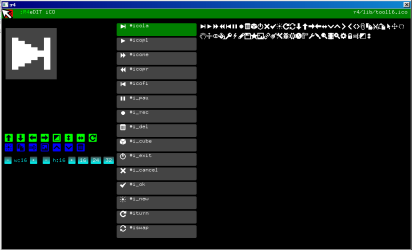

# Icons

The bitmaps monocromatic icons were one of the last incorporations of the whole system, in fact they are very simple, they are limited to 32 pixels wide so you can see that I will use a dword for each line.
The words for draw icons is in r4/lib/fonti.txt, this is the default font and bitmaps icons.

Draw and icon with ink color:

```
::drawico | c --
```

Draw and icon with ink color in inverse:

```
::drawnico | c --
```

Draw and icon with color defined:

```
::drawcico | color c --
```

The first use is the editors of icons. If you see the code editor (ide/edit-code.txt), when hit Ctrl-E the system execute a program with the name "r4/system/inc-%w.txt" in line 260.
This program edit a file with the name write in the code and return the variable definition with the numbers generated with the editor, is other file formats, inc-.. manage multiple instances for every variable and call the real editor, but in icons this is very simple and the the collection and the editor is in the same program.

In r4/lib/btn line 138 start the definition of buttons with icons and toolbars with this representation of bitmaps.



