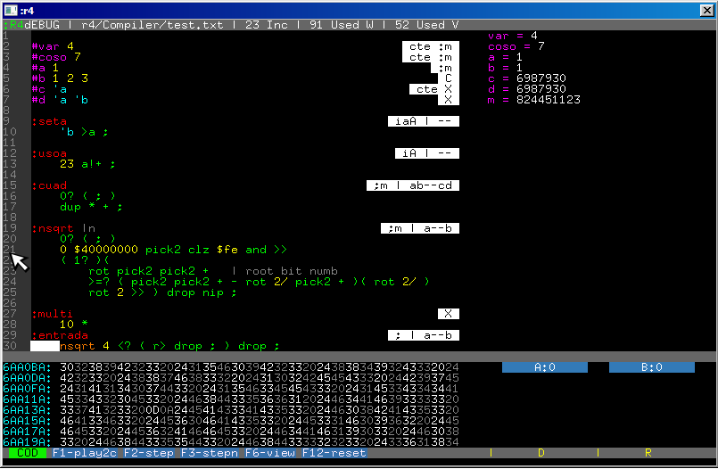

# Debug in :r4

One of the characteristics of the forth is the interactivity, this produces a gradual development word by word,: r4 has no interactivity, although it is possible to add it and at some point it will have an interactive ide, so when a program is executed and this fails it is a little more difficult to find the error.

## Errors

Some common types of errors:

1. Wrong-written word error: this is the easiest error to detect, simply the program will not run and the error message of word not found will appear.

2. Growth or unbalance of the stack until it explodes: The execution of each word has defined an input stack and an output stack, this can be seen as blocks that fit the parameters of the word these coupling places. The unbalance of a word can be given by mistaking the values that it needs or that it leaves, a loop that consumes the whole stack or that adds indefinite values will produce a break in the system

3. Using a memory address incorrectly or confusing a value with an address,: r4 does not check this kind of type, although it would be possible to track it.

4. badly constructed logic or poor understanding of the problem. There is nothing to do here but continue studying to find a solution.

## Trace library

The first word to debug a program is `trace`, when the corresponding library is included it is easy to stop the program and see some higher cells of the data stack. Many times this is enough to find where it is failing

`^r4/lib/trace.txt`

The trace library adds some words to stop the execution and inspect the stack or a portion of memory.

```
::memmap	| inimem --
::trace	| --
::=trace	| nro --
::<trace	| nro --
::>trace	| nro --
::log	| "" --
```

`Memmap` show a dump of memory and conditional trace stop when reach some value in stack, `log` make a file with a log for the purpose of debugging.
The first question to solve when a program hangs is where, for this you can put trace in different places to find this place.

## Step by Step Debugger

In the integrated editor you can access a debugger by pressing f2, what happens here is that the program is tokenized and it is possible to simulate the execution of the program. Keep in mind that the system is executing an interprete on another interpreter!

The tokenizer is the same one that is used to compile or transform code, it has an error report and calculates the stack movement in the words, you can find words that are not executed or variables that are actually constant.



In the debugger you can hit f1 to play to cursor, f2 to step with enter in word defined, f3 to step but not enter in the word definition. f6 view the framebuffer. TAB change the window, CODE, VARS, MEM and STACK.


