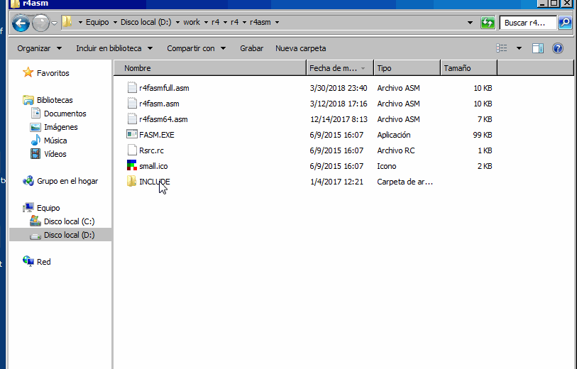

# :r4 Compiler

## Generate code for x86

The generation of code from the plain.txt is make in.

```
compiler/r4-asmcode86-0.txt
```

There are a basic code generator, very simple. Every basic word can be translate to assembly and simple concatenate this instruction the code is ready.

This compilers make a unoptimized code, very dumb but work.

The compiler generate code for add to a simple framework, this create a graphic windows and keep track about event in the windows OS, the keyboard, the mouse and some interface to API calls.

The data stack is simulated, EAX is the value of top os stack, the stack is in memory in DATASTK definition, EBP point to next to data stack.

The return stack is the normal ESP return stack.

ESI and EDI are the A and B registers.

The compile generate two files, code.asm and data.asm and put in the r4asm/ folder, here the framework called r4asm.asm include this files for make an executable.

The assembly is done with the FASM compiler [FlatAssembler](https://flatassembler.net/)



The blocks of code is converted to conditional jump and jumps.

## More optimized code for x86

The key concept is simulate the stack with registers, is some cases the stack disappears in registers.

## Cell information

The first stage is the same of unoptimized code, but change when generate code for every word.

We perform the cell analysis in `compiler/r4-cellana.txt` code. This word fill some arrays with information of execution.

Cell information, every cell used in word in:

```
#:cells )( 1024
#:cellt )( 1024
#:cellv )( 1024
```

Stack information, what cell used in every word of definition in:

```
#:stki )( $fff		| stack of tokens
#memstk )( $ffff	| stack memory
#memstk> 'memstk
```

The main idea is collect information of cells, who cell is static (only read), who cell is used in calculus (arithmetic or logic operations), or in memory (access to memory for read or write), cell live segment and others.

Example of sqrt code with comments, actual development:
```
; vreg:4
; IN: eax
; ---- blocks ----
; ;IF  (2:4) d:1 v:1
; WHI (12:14:36) d:0 v:5
; IFE (20:29:32) d:0 v:4
; ---- cells ----
; 0 R:3 W:2 >W W> noC (0:41) 1
; 1 R:2 W:3 W> noC (5:39) 2
; 2 R:4 W:2 noC (6:37) 3
; 3 R:1 W:2 CPY U C (7:11) 4
; 4	 CTE R:1 U $FE (9:10) 0
; 5 R:1 W:1 CPY U (16:19) 4
; 6	 CTE R:1 CPY U 2 (17:18) 0
; 7 R:1 W:1 CPY (21:24) 4
; 8	 CTE R:1 CPY U 2 (22:23) 0
; 9	 CTE R:1 CPY U 2 (27:28) 0
; 10	 CTE R:1 U C $2 (34:35) 0
	; 0 | :sqrt_46	| 0 | eax
; sqrt_46 | a--b | ;m | len:40 | calls:1
w15:
	; 1 | 0?	| 0 | eax
	; 2 | (	| 0 | eax
or eax,eax
jnz _1
	; 3 | ;	| 0 | eax
ret
	; 4 | )	| |
_1: 	; 5 | $0	| 0 | eax
xor ebx,ebx
	; 6 | $40000000	| 0 1 | eax ebx
mov edx,$40000000
	; 7 | PICK2	| 0 1 2 | eax ebx edx
mov ecx,eax
	; 8 | CLZ	| 0 1 2 3 | eax ebx edx ecx
bsr ecx,ecx
xor ecx,31
	; 9 | $FE	| 0 1 2 3 | eax ebx edx ecx
	; 10 | AND	| 0 1 2 3 4 | eax ebx edx ecx $FE
and ecx,$FE
	; 11 | >>	| 0 1 2 3 | eax ebx edx ecx
sar edx,cl
	; 12 | (	| 0 1 2 | eax ebx edx
_2: 	; 13 | 1?	| 0 1 2 | eax ebx edx
	; 14 | )(	| 0 1 2 | eax ebx edx
or edx,edx
jz _3
	; 15 | ROT	| 0 1 2 | eax ebx edx
	; 16 | PICK2	| 1 2 0 | ebx edx eax
mov ecx,ebx
	; 17 | PICK2	| 1 2 0 5 | ebx edx eax ecx
	; 18 | +	| 1 2 0 5 6 | ebx edx eax ecx edx
add ecx,edx
	; 19 | >=?	| 1 2 0 5 | ebx edx eax ecx
	; 20 | (	| 1 2 0 | ebx edx eax
cmp eax,ecx
jl _4
	; 21 | PICK2	| 1 2 0 | ebx edx eax
mov ecx,ebx
	; 22 | PICK2	| 1 2 0 7 | ebx edx eax ecx
	; 23 | +	| 1 2 0 7 8 | ebx edx eax ecx edx
add ecx,edx
	; 24 | -	| 1 2 0 7 | ebx edx eax ecx
sub eax,ecx
	; 25 | ROT	| 1 2 0 | ebx edx eax
	; 26 | 2/	| 2 0 1 | edx eax ebx
sar ebx,1
	; 27 | PICK2	| 2 0 1 | edx eax ebx
	; 28 | +	| 2 0 1 9 | edx eax ebx edx
add ebx,edx
	; 29 | )(	| 2 0 1 | edx eax ebx
jmp _5
_4: ; cpy: 1 >>
	; 30 | ROT	| 1 2 0 | ebx edx eax
	; 31 | 2/	| 2 0 1 | edx eax ebx
sar ebx,1
	; 32 | )	| 2 0 1 | edx eax ebx
_5: 	; 33 | ROT	| 2 0 1 | edx eax ebx
	; 34 | $2	| 0 1 2 | eax ebx edx
	; 35 | >>	| 0 1 2 10 | eax ebx edx $2
sar edx,$2
	; 36 | )	| 0 1 2 | eax ebx edx
jmp _2
_3: 	; 37 | DROP	| 0 1 2 | eax ebx edx
	; 38 | NIP	| 0 1 | eax ebx
	; 39 | ;	| 1 | ebx
lea eax,[ebx]
ret
```

The first block of info is: IN the registers in stack from input, the eax is the container. Next a list of blocks of code with the numbers of instructions. Next a list of cell used, with the quantity of reads (R) and writes (W), if is a constant a CTE, some other info, the life (from:to) and the virtual register. In this word, only with 3 register you can compile.

Then the list of words with the current stack precalculate in previous analysis, and the stack in real values.

The next block is the source token, the stack with number of cell and the real stack in this moment. The lines without ; is the code generated, the labels are global.

If the numbers of virtual register is less of real and not have case of recursion or different cell in input or output stack, then only assign real registers to virtual ones produce good code.

### Th Blocks

The blocks of code are converted with conditional jumps, but with this schema, we have a more complex scenario, the stack representation need to be converted to the correct format for normal work. There are two flavors, with terminator ; or not

#### IF

An example of this is:

```
1? ( word )

; This generate code like:

; conditional
; point (A)
	jz _JUMP
	call word
_JUMP:
; in this point the stack is the same like point (A)
```

take note for the construction:

```
1? ( worda ; ) wordb

; This generate code like:

; (A)
	jz _JUMP
	jmp worda ; now the stack in exit of worda is the same of exit of current 		definition
_JUMP:
; stack same in (A)
```

is a IF-ELSE, the wonderful colorforth not have else for this construct!, really is good to think if you need the ELSE part, this construction increase the factorization of code.

#### IF-ELSE

```
0? ( worda )( wordb )

; Generate...

	jnz _ELSE
	call worda
; (A)
	jmp _ENDIF
_ELSE:
	call wordb
; same in (A)
_ENDIF:
```

See when need normalize to a same stack representation, no matter how is this representation, can be registers or real stack.
This normalizations is the key to generate code for avoid real stack operation, if you normalize to one form in every of this point and before every call, you generate code ok but not optimal.

#### WHILE

The most versatile and powerful execution flow construction. When I start define r4 I think a lot how implement the FOR construction, when start code with this WHILE, the FOR disappear, very elegant and complete. Don't force the first part to one word!.
The code generate can avoid a jump with some modification.

```
( worda 1? )( wordb )

; Generate...

_INWHILE:
; (A)
	call worda
	jz _ENDWHILE
	call wordb
; stack to (A)
	jmp _INWHILE
_ENDWHILE:

; and more efficient (one jmp less in inner loop)

	jmp _INWHILE
_LOOPWHILE:
; stack to (A)
	call wordb
_INWHILE:
; (A)
	call worda
	jnz _LOOPWHILE ; see the inverse of conditional
```

#### UNTIL

It is not widely used, something is more simple a while because you need drop a value.It is more efficient to have a jump less, but sometimes it is necessary to do a calculation before reentering the loop and this is done with WHILE.

```
( word 1? )

; Generate...

; (A)
_REPEAT:
	call word
; stack to (A)
	jz _REPEAT
```

#### REPEAT

The least used, only can break for a return stack manipulation or system.

```
( word )

; Generate...

; (A)
_REPEAT:
	call word
; stack to (A)
	jmp _REPEAT
```

