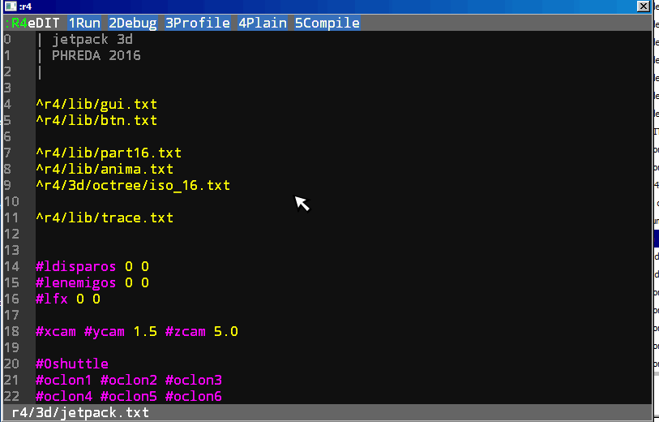

# Profiler in r4

With the tokenizer is posible regenerate the code with add some code to measure the times on execution.

This aproach can be used in compiler too, then you can measure the profile in the interprete mode and the executable mode.

The generator is in `IDE/profiler-code.txt`. The mechanism used is to add in each definition a code that is executed before and a code that is executed later.  A word is defined following the original definition by executing `profile_start` before and `profile_end` after.

these words are defined in `lib/r4-incprofile.txt` and record the number of calls between words and the time used in their execution, record this table to the disk when the execution finishes.

