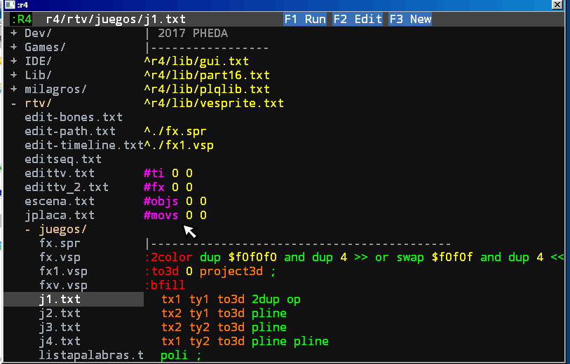

# Vector Editor

There are many version of vector sprites, the last is the `.vsp` files, previous are `.spr`
The last editor is `system/edit-ves.txt`. Some capabilities are missing, and there are some errors but you can import drawings from `.svg` files, not full compatible.

The Sprite is encoded in 32 bits numbers with 0 terminate, like a string. In every cell 4 have 4 bits operation and two 14 bits coordinates or 24 bits color.

The lib is `lib/vesprite.txt`, you can draw with pos/dim words:

```
::vesprite | 'adr --
```

with rotation:

```
::rvesprite | 'adr ang --
```

in 3d, with 3dmath stack:

```
::3dvesprite | 'adr --
```

and full interpolate:

```
::vespriteInter | n s1 s2 s3 --
```

When the editor is called with a .vsp file what is executed is, first, the system of denomination of variables, the copy, the deletion, the import of svg and just when a single drawing is edited the editor itself is called.

