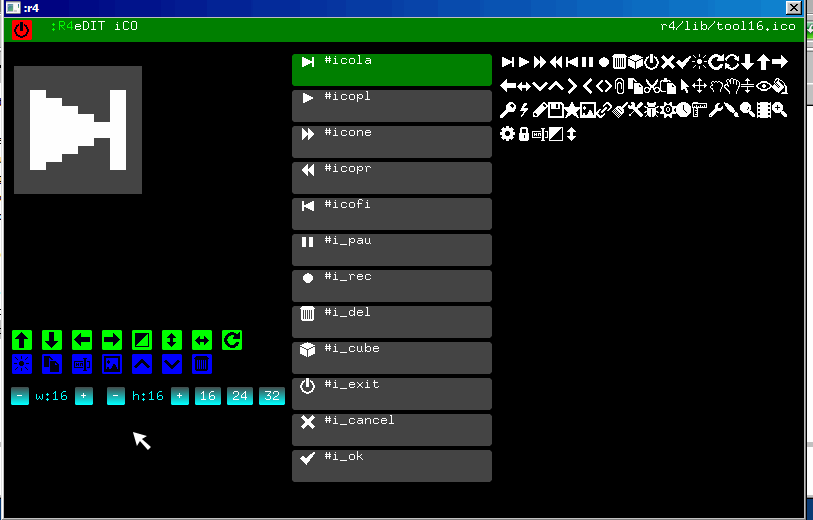

# Icon Editor

The vector editor is in `system/inc-ico.txt`. This editor is very simple then the multiple icons are managed by the same code.

The format is a monocrome bitmap, the words for draw is in `\Lib\fonti.txt`. The first DWord is the size, then heigth dwords, width is until 32.

