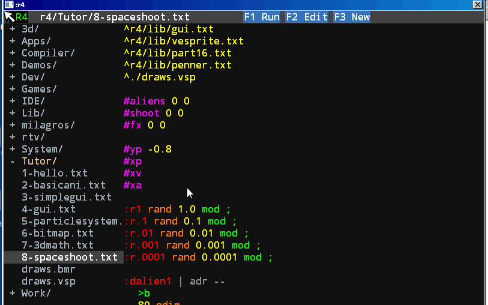

# :r4 programing languaje

## Source

:r4 is a language derived from ColorForth created in 2005.
As all Forth is Minimalist, it does not need complex mechanisms of abstraction, in fact the only means of abstraction is the adress.
Forth is not popular these days but curiously does not die, every programmer of forth knows why.



## Idea

The idea is simple:
```
* Any number in source code go to the data stack.
* Any adress of word is stack too.
* Any word (characters separate by spaces) search in dictionary,
  +	If is found execute the word.
  +	Else is an error, stop compilation!!
```

Unlike ColorForth, the meaning of words is defined by prefixes.
the most importan is ' (adressof) then *word* execute a word, and *'word* is the adress of word.
This adress is a powerfull abstraction, many languajes try to avoid this, but here we recommend its use.

For make a program you need define yours words to express the algorithm that tries to solve the problem to be programmed.

A program have two types of words, actions and data, time and space. For define an action :r4 use the prefix : and to define data the prefix #

```
:thiswordisanaction 1 2 3 + * ;

#thisisdata 33
```

When you define a word, only you can use a word previous defined, or current definition for recursive words.

When start a program, the diccionary have basic definitions:

[Main Diccionary](doc/main-dicc.md)

The main diccionary has a basic interaction with the OS, 12 words, very basic. This aproach has some advantages over recreate all the API calls.

* Not deal with deprecate and diferent behavior in versions.
* Is easy port to other OS or embebed in a boot image. No OS !
* The compiler only need code this 12 words for comunicate with the OS.

The cons is not have full access to hard, for now!, you or my can modify this in any moment.

Words for SOUND, PRINTER, JOYSTICK and WEB has a definition for particular nedded,but the idea is avoid this and in some point, recreate in :r4, the graphics words are already recreate for the actual compiler.

Keep it simple, this is the main path, but simple is not easy, is a search in the world of problem for extract or ideate a correct and basic solution.

## A more advanced introducction

[Landscape](doc/landscape.md)

[More about Registers](doc/registers.md)

## Current development

The current development in computers is dominated by certain ideas that in my opinion are wrong.

The idea of using complex structures to simplify development only makes the problem worse. In addition to hiding certain parts of the problem that should be exposed to see the solution correctly.

The idea of defensive programming by calling a lawyer and making it clear that it can be done and not done, even before writing a single calculation, now instead of having an algorithm, we have an algorithm and a lawyer.

Many good programming practices are wrong, since you try to find a generality in the development and the systems solve a unique problem, not a different set of problems. Charles Moore say, real programs execute in real computers.

## Basic Library

[Configuration](doc/0-configure.md)

[The Basics](doc/1-basics.md)

[The Main Loop](doc/2-mainloop.md)

[Strings](doc/strings.md)

[Vectors Graphics](doc/3-vectors.md)

[Animation](doc/4-animation.md)

[Memory](doc/5-memory.md)

[Fonts](doc/6-font.md)

[Mprint](doc/6.1-mprint.md)

[GUI](doc/7-gui.md)

[Data Structures](doc/8-data.md)

[Math](doc/9-math.md)

[Bitmaps](doc/10-bitmaps.md)

[Icons](doc/11-icons.md)

[3d Math](doc/12-3d Math.md)

[Debug](doc/13-debug.md)

[Random](doc/14-random.md)

[Memory Data Base](doc/15-dbm.md)

[Basic Shooter](doc/16-simple shooter.md)

## Compiler

The :r4 compiler make two files in r4asm/ folder, code.asm and data.asm and then this is compile when call FASM.

[Tokenizer](doc/c1-tokenizer.md)

[Post Tokenizer](doc/c2-postokenizer.md)

[Generate Code](doc/c3-generatecode.md)

[Profiler Code](doc/c4-profiler.md)

## Editors

[Text Editor](doc/e1-texteditor.md)

[Vector Editor](doc/e2-vectoreditor.md)

[Bitmap Editor](doc/e3-bitmapeditor.md)

[Icon Editor](doc/e4-iconeditor.md)
