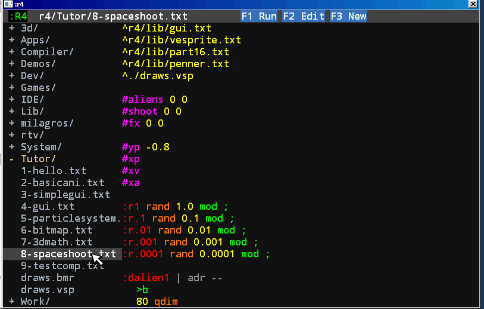

# :r4 programing language

## Source

:r4 is a language created in 2005, based on ColorForth. 
Since all Forths are minimalistic, :r4 does not need complex mechanisms of abstraction, in fact the only mechanism of abstraction is the address.
Forth isn't as popular these days, but curiously does not die. Every Forth programmer knows why.



## Idea

The idea is simple:
```
* Any number in the source code goes directly to the data stack.
* Any address of a word goes to the stack too.
* Any word (characters separate by spaces) searches in the dictionary,
  +	If it is found, execute the word.
  +	Else is an error, stop the compilation!!
```

Unlike ColorForth, the meaning of words is defined by prefixes.
The most important prefix is `'` (adressof). If `word` executes a word, then `'word` is the address of the word.
This address prefix is a powerful abstraction, many languages try to avoid this, but here we recommend its use.

To create a program, you need to define words that express an algorithm that tries to solve the problem that is being solved.

A program has two types of words: actions and data (time and space). To define an action :r4 uses the prefix `:` and to define data the prefix `#`

```
:thiswordisanaction 1 2 3 + * ;

#thisisdata 33
```

When you define a word, you can use previously defined words, or the current word for recursive words.

When you start a program, the dictionary has the following basic definitions:

[Main Dictionary](doc/main-dict.md)

The main dictionary has a basic interaction with the OS, 12 words, which is very basic. This approach has some advantages over trying to recreate all the API calls.

* Not deal with deprecate and different behavior in versions.
* It is easy to port to other OS or embed in a boot image. No OS required!
* The compiler only needs these 12 words to communicate with the OS.

The cons is not having full access to hardware, for now!, we can modify this at any moment.

Words for SOUND, PRINTER, JOYSTICK and WEB has a definition for particular needs, but the idea is to avoid this and at some point, recreate in :r4, the graphics words are already recreate for the actual compiler.

Keep it simple, this is the main path, but simple is not easy, is a search in the world of problem for extract or ideate a correct and basic solution.

## A more advanced introduction

[Landscape](doc/landscape.md)

[More about Registers](doc/registers.md)

## Current development

The current development in computers is dominated by certain ideas that in my opinion are wrong.

The idea of using complex structures to simplify development only makes the problem worse. In addition to hiding certain parts of the problem that should be exposed to see the solution correctly.

The idea of defensive programming by calling a lawyer and making it clear that it can be done and not done, even before writing a single calculation, then now instead of having an algorithm, we have an algorithm and a lawyer.

Many good programming practices are wrong, since you try to find a generality in the development and the systems solve a unique problem, not a different set of problems. Charles Moore say, real programs execute in real computers.

## Basic Library

[Configuration](doc/0-configure.md)

[The Basics](doc/1-basics.md)

[The Main Loop](doc/2-mainloop.md)

[Strings](doc/strings.md)

[Vectors Graphics](doc/3-vectors.md)

[Animation](doc/4-animation.md)

[Memory](doc/5-memory.md)

[Fonts](doc/6-font.md)

[Mprint](doc/6.1-mprint.md)

[GUI](doc/7-gui.md)

[Data Structures](doc/8-data.md)

[Math](doc/9-math.md)

[Bitmaps](doc/10-bitmaps.md)

[Icons](doc/11-icons.md)

[3d Math](doc/12-3d Math.md)

[Debug](doc/13-debug.md)

[Random](doc/14-random.md)

[Memory Data Base](doc/15-dbm.md)

[Basic Shooter](doc/16-simple shooter.md)

## Compiler

The :r4 compiler make two files in r4asm/ folder, code.asm and data.asm and then this is compile when call FASM.

[Tokenizer](doc/c1-tokenizer.md)

[Post Tokenizer](doc/c2-postokenizer.md)

[Generate Code](doc/c3-generatecode.md)

[Profiler Code](doc/c4-profiler.md)

## Editors

[Text Editor](doc/e1-texteditor.md)

[Vector Editor](doc/e2-vectoreditor.md)

[Bitmap Editor](doc/e3-bitmapeditor.md)

[Icon Editor](doc/e4-iconeditor.md)
